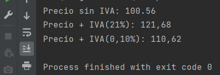

# OB / Curso de Java Base
## Entrega ejercicios tema 2

**Enunciado del ejercicio:**

Para este ejercicio tendréis que crear una función que reciba un precio y devuelva el precio con el IVA incluido.

### Salida en consola:
