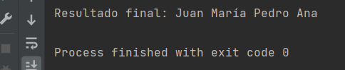

# OB / Curso de Java Base
## Entrega ejercicios tema 3

**Enunciado del ejercicio:**

En este ejercicio tenéis que crear un bucle que permita concatenar textos e imprima el resultado final por consola.

Tened en cuenta que los textos pueden venir de un array de tipo String. Por ejemplo:
```
String[] nombres = {"", "", "", ""}
```

### Salida en consola:
