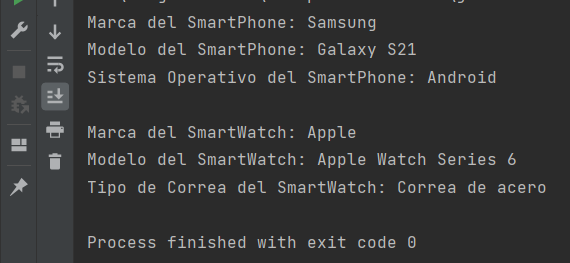

# OB / Curso de Java Base
## Entrega ejercicios tema 4

**Enunciado del ejercicio:**

En este ejercicio tendréis que crear una clase SmartDevice. Dentro crearéis las clases hijas: SmartPhone y SmartWatch.

Agregaréis atributos tal cual tendrían esos objetos en la realidad.

Crear constructor vacío y con todos los parámetros para cada clase.

Desde una clase Main: crearéis objetos de cada una y los utilizaréis para imprimir sus valores por consola.

### Salida en consola:
