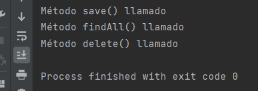

# OB / Curso de Java Base
## Entrega ejercicios tema 5

**Enunciado del ejercicio:**

Crear una interfaz CocheCRUD.

Crear una implementación CocheCRUDImpl que implemente la interfaz CocheCRUD.

Como métodos de CocheCRUD podemos poner:

save() findAll() delete() que simplemente impriman por consola el nombre del propio método.

Desde una clase Main, Crear un objeto de tipo CocheCRUDImpl y llamar a cada uno de los métodos.

Ejemplo:
```
CocheCRUD cocheCrud = new CocheCRUDImpl()
```

### Salida en consola:
